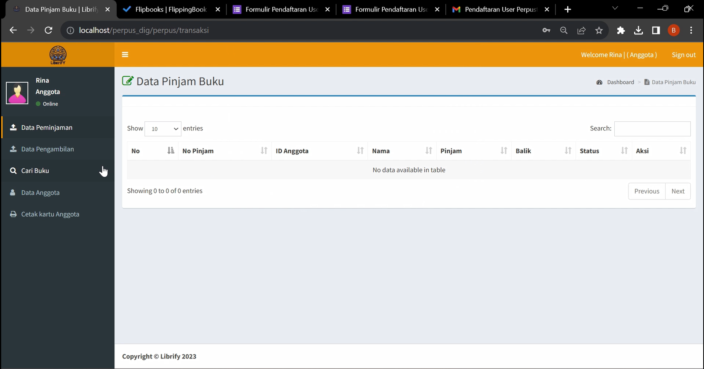
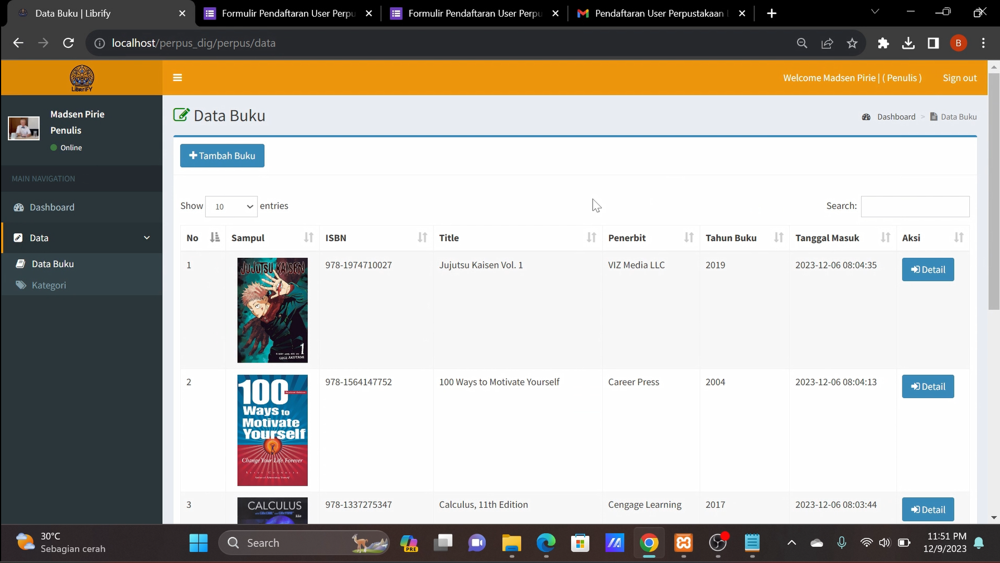
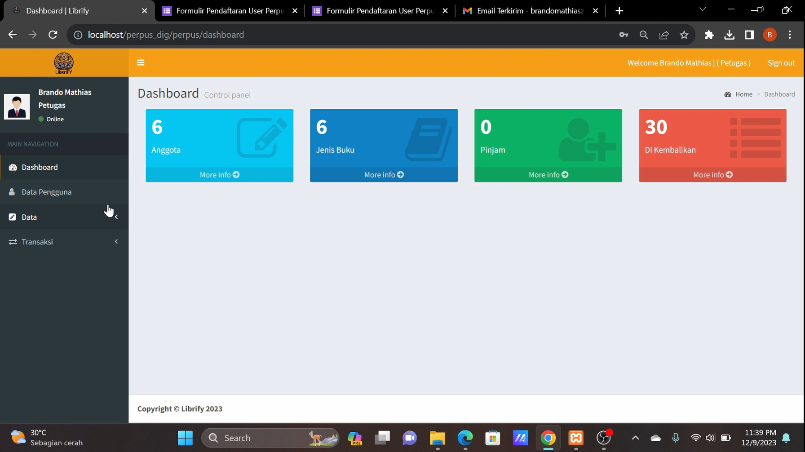

# 📚 LIBRIFY — Web-Based Digital Library System

Librify adalah aplikasi perpustakaan digital berbasis web yang dirancang untuk mempermudah pengelolaan koleksi buku, transaksi peminjaman, serta manajemen pengguna (anggota, petugas, dan penulis/publisher).  

Proyek ini dikembangkan sebagai tugas project mata kuliah **Rekayasa Perangkat Lunak — Semester 3**  
Program Studi **Teknik Informatika — Universitas Sam Ratulangi**.

---

## 🎯 Tujuan Pengembangan

- 💡 Menghadirkan sistem perpustakaan digital yang terstruktur & mudah diakses  
- 📖 Menyediakan katalog buku digital lengkap beserta detail informasi  
- 🔎 Mempermudah proses pencarian, peminjaman, & pengembalian buku  
- 🧩 Menerapkan konsep Software Requirement Specification (SRS)  
- 🚀 Menjadi simulasi aplikasi perpustakaan berbasis web skala nyata  

---

## 🚀 Fitur Utama

### 👤 Anggota Perpustakaan
- Melihat & mencari buku  
- Melakukan peminjaman buku  
- Melihat riwayat pinjam / kembali  
- Mencetak kartu anggota  

### 🧑‍💼 Petugas Perpustakaan
- Mengelola data anggota  
- Mengelola transaksi peminjaman & pengembalian  
- Monitoring statistik aktivitas  

### ✍️ Penulis / Publisher
- Mengunggah & mengelola koleksi buku  
- Mengelola kategori & metadata buku  
- Melihat daftar koleksi terpublikasi  

### 🛡️ Administrator
- Manajemen pengguna & peran  
- Validasi akses sistem  
- Pengelolaan koleksi buku digital  

> Perancangan sistem mengacu pada dokumen SRS: Use Case, Logical View, Process View, ERD, Development View, dan Physical View.

---

## 🧠 Konsep & Arsitektur Sistem

- 🌐 Sistem berbasis web & database  
- 🔐 Mendukung autentikasi & otorisasi pengguna  
- 🗂️ Data terpusat pada MySQL  
- 📑 Proses bisnis dirancang sesuai prinsip RPL  
- 🧱 Modular & scalable untuk pengembangan lanjutan  

---

## 🛠️ Teknologi yang Digunakan

- ⚙️ PHP  
- 🗄️ MySQL (XAMPP)  
- 🎨 HTML, CSS, Bootstrap  
- 🧩 Template Admin Dashboard  
- 🖥️ Visual Studio Code  
- 🌍 Localhost Development Environment  

---

## 🖼️ Cuplikan Tampilan

> Simpan screenshot ke folder `asset/` agar path sesuai

### 👤 Tampilan Anggota


### ✍️ Tampilan Penulis


### 🧑‍💼 Tampilan Petugas


---

## 📂 Struktur Proyek (Ringkas)

```text
/librify
 ├── asset/
 ├── app/
 ├── database/
 ├── public/
 ├── views/
 ├── index.php
 └── README.md
```

> Struktur dapat berbeda menyesuaikan implementasi proyek.

---

## 👥 Anggota Kelompok

Proyek ini dikembangkan oleh:

- BRANDO M. ZUSRIADI  
- CHRIS MASSIE  
- CHRISTIAN A. ROEROE  
- DHIVA M. RUNKAT  
- TEOFIDE W. K. PANGEMANAN  

Program Studi  
**Teknik Informatika — Universitas Sam Ratulangi**

---

## 📌 Status Proyek

🟢 Academic Project — Completed  
🎯 Fokus implementasi:  

- Analisis & perancangan kebutuhan perangkat lunak  
- Perancangan arsitektur & proses bisnis  
- Simulasi pengembangan aplikasi perpustakaan digital  

---

## 📜 Lisensi & Penggunaan

Proyek ini dibuat untuk keperluan akademik & pembelajaran.  
Penggunaan ulang diperbolehkan dengan mencantumkan atribusi yang sesuai.
